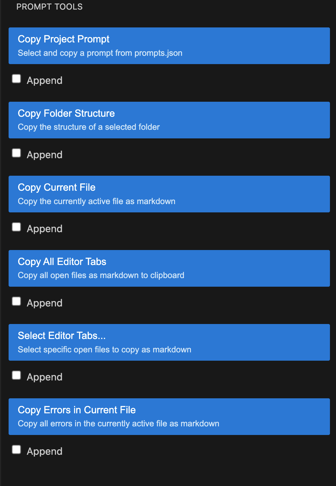

# Simple Prompt Tools

This is a simple collection of tools that make developing with LLMs like ChatGPT easier, in the form of a VSCode extension

## Problems this fixes

Example Scenario: You're developing a full stack Next.js application and working on a new feature which involves a frontend page (3 components, each their own file)
and a file that handles the backend. To use an LLM for development, you need to

- write out and explain...
  - the purpose of your project
  - the tech stack/libraries you're using
  - the file structure
  - coding styles and conventions you're using
  - the feature you're working on
  - etc
- Open each relevant file, copy the code, paste it into the LLM and add a markdown code block for each file
- When you get the response and paste it back into your project, if it has errors, go to each error in your editor, copy the line #, line contents, and error and send it back to the LLM

## Simple Prompt Tools

This extension creates a simple sidebar with buttons to automate & speed up every step of that process to save you time


### Project Prompts

The most important action is `Copy Project Prompt`. It reads from a `prompts.json` file in the root folder of the current project, which might look like this:

```json
{
	"prompts": [
		{
			"name": "General System Prompt",
			"message": "The current project is a VSCode extension that makes AI development prompting easier within the IDE. It is written in typescript and bundled with webpack. The main code is src/extension.ts"
		}
	]
}
```

This lets you define multiple prompt templates for your project to easily copy them. For example:

- General Prompts explaining the purpose of the project, tech stack, etc
- Prompts for sub-repos in monorepos with more details
- Prompts for individual parts or features of the application to provide context about what is being worked on to the LLM

Because it's a file in the project, it's also tracked by git and can be shared with teammates.

### Workflow

For each action, a checkbox labeled "Append" is included. This enables powerful workflows like:

- Copy the project prompt
  - (Append additional prompts)
- Append the file structure
- Append relevant files
- Append errors
